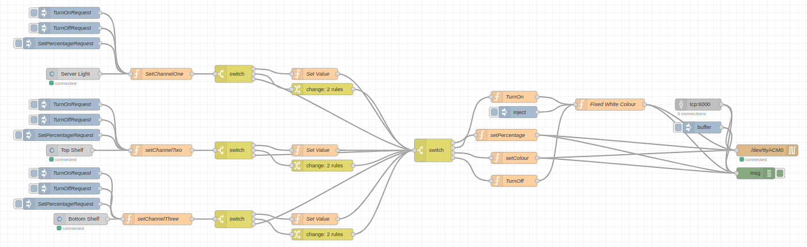

# Node-Red Software

## Summary

This application is revolved around NodeRed and is the flow used to integrate alexa with the hardware. The basic idea of the Node-Red Flow is to act as a bridge between Alexa and the Hardware. This specific flow is using USB Serial, to connect to an STM32 Based hardware Solution. In order to add IP to this solution, a TCP Server is used inside this flow, thus allowing the hardware to interact with IP based applications. The flow is shown below:

## Installation Instructions

- First install Node-Red on your machine. This can be done by following the instructions [here](https://nodered.org/docs/getting-started/local)
- Once Node-Red is installed, open the Node-Red editor and import the flow from the file `src/flows.json`
- Once the flow is imported, you will need to install the required plugins. These are listed below.
- Once all this is installed, setup the alexa plugin and configure the hardware wether that be a serial connection or an IP based connection.

## Node-Red Plugins

For using this flow the following plugins are required:

- [node-red-contrib-alexa-home-skill (0.1.19)](https://flows.nodered.org/node/node-red-contrib-alexa-home-skill)
- [node-red-node-serialport (0.15.0)](https://flows.nodered.org/node/node-red-node-serialport)
