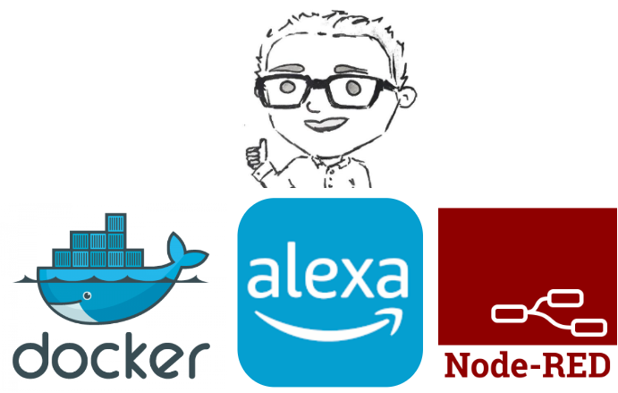

# Node-Red Software

## Summary
Within this directory of the repository there are two folders:
 - Node-Red Flow
 - Node-Red Package

 The reason for this is that the Node-Red Flow is a direct sample of the system using the raw Node-Red components such as the Serial Node and Alexa integration Nodes. This allowed each channel to be its own alexa device. The required plugins and their versions are listed below:

## Node-Red Plugins
 - [node-red-contrib-alexa-home-skill (0.1.19)](https://flows.nodered.org/node/node-red-contrib-alexa-home-skill)
 - [node-red-node-serialport (0.15.0)](https://flows.nodered.org/node/node-red-node-serialport)

 The Node-Red package is a work in progress package to encapsulate all of this code and put everything in one node for the future developer. Currently this is still in development 
 
 //todo: Finish this