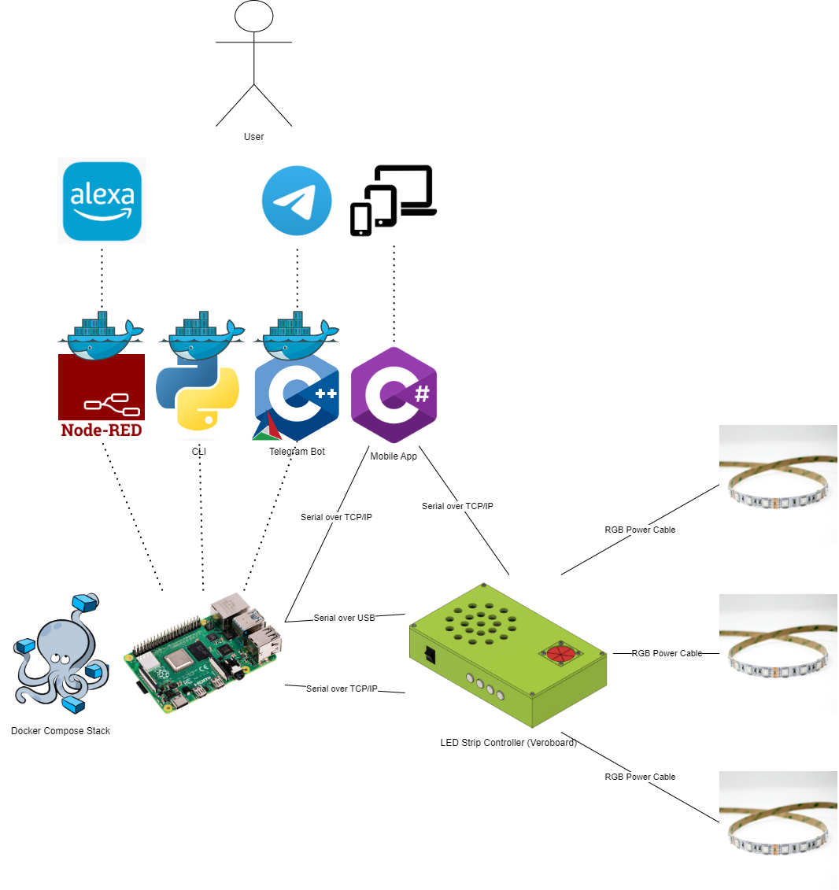

# LED Strip Controller Software

## Summary

As discussed earlier, the project revolves around colour control of different LED strips. At this level of the project, this repository is concerned with the high-level software running on systems outside of the device. This is why high-level languages such as Python and C# are used. The idea of this software is to interface with the hardware system through either USB or TCP/IP and allow the user to control the device. The software is split into four different applications, each with its own purpose. The first is a Python command line interface that allows the user to control the device through a series of questions. The second is a Node-Red application that acts as a gateway between the hardware and Alexa. The third application is a C# Graphical User Interface which allows the user to control the device through a GUI, the idea of this application is to be cross platform control. The last application to be built is a telegram bot which allows the user to control the device through a popular messaging application Telegram.

The overall system diagram is shown below, depending on the hardware platform the applications may have to go through the Raspberry Pi first as the hardware platform might not have IP support. This is the case with the STM32 devices as they don't have built-in WiFi or Ethernet support.

# Repository Structure

The repository is split into four different submodules, each with its own purpose. The submodules are as follows:

- [Python Command Line Interface](./Tui/): Allows the user to control the device through a series of questions, these questions ask what interface the user is using, followed by a series of questions to enable the specific lighting they want.

- Node-Red Application: Acts as a gateway between the hardware and Alexa, this application is built using Node-Red and is designed to run on a Raspberry Pi. This application talks to the hardware using the predefined protocol and uses the Alexa Node-Red libraries to convert speech into actions for the hardware to perform.

- [Multi Platform App](./Multi%20Platform%20App/): Acts as a Graphical User Interface to control the hardware, the idea with this app, is that its a multi-platform control GUI which can run on smartphones and desktops.

- [Telegram Bot](./Telegram%20Bot/): Acts as a Telegram Bot to control the hardware, this was chosen because Telegram is a popular messaging application and it would be a good way to control the hardware, along with allows CMake to be used with the project.

## LED Strip Controller Repository Links

- [Manifest](https://github.com/ScottGibb/LED-Strip-Controller-Manifest) This repository contains the manifest file for the LED Strip Controller project. Which allows cloning of all the repositories in one go.
- [Hardware](https://github.com/ScottGibb/LED-Strip-Controller-Hardware) This repository contains the hardware design files for the LED Strip Controller project.
- [Firmware](https://github.com/ScottGibb/LED-Strip-Controller-Firmware) This repository contains the firmware for the LED Strip Controller project.
- [Software](https://github.com/ScottGibb/LED-Strip-Controller-Software) This repository contains the software for the LED Strip Controller project.
